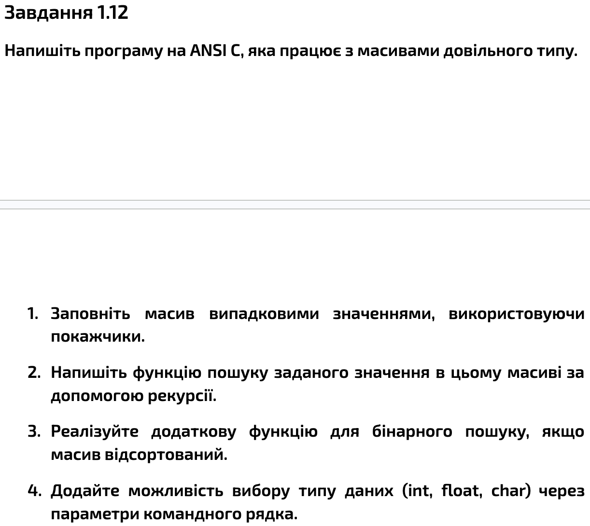
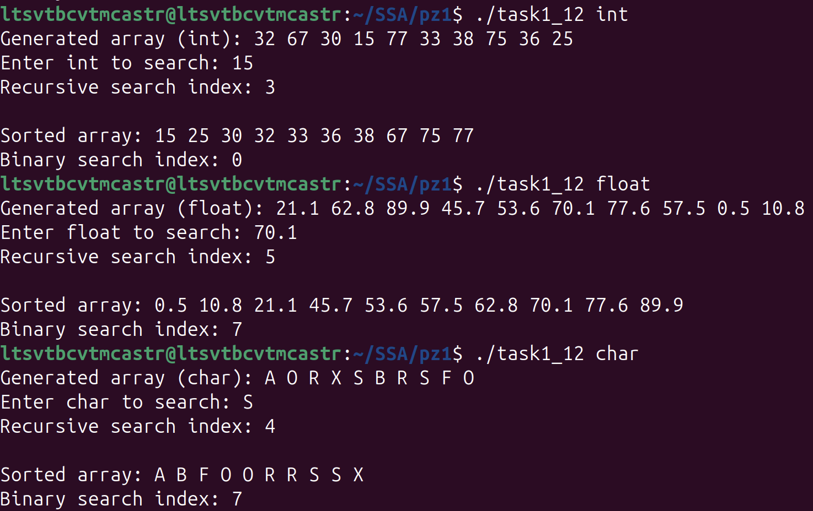

# Practical Work 1

## Task 1.12


### Compilation
```bash
gcc -Wall -Wextra task1_12.c -o task1_12
```

### Usage
```bash
./task1_12 int
./task1_12 float
./task1_12 char
```

### Execution Results

