# Practical Work 2

## Task 2.1
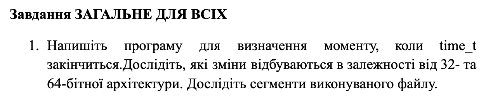

### Explanation
The simulation demonstrates how time representation changes depending on the architecture. For a 32-bit architecture, the maximum value of `time_t` is `2147483647`, which corresponds to January 19, 2038, at 03:14:07 UTC. After this second passes, an integer overflow occurs (known as the "Year 2038 problem"). For a 64-bit architecture, the maximum value is significantly larger, pushing the expiration date approximately 292 billion years into the future. 

The `size` utility maps out the memory segments required by the compiled binary file: `text` (executable instructions), `data` (initialized global/static data), and `bss` (uninitialized global/static data). The `nm` utility prints the symbol table of the binary, revealing the low-level virtual addresses and type flags.

### Results
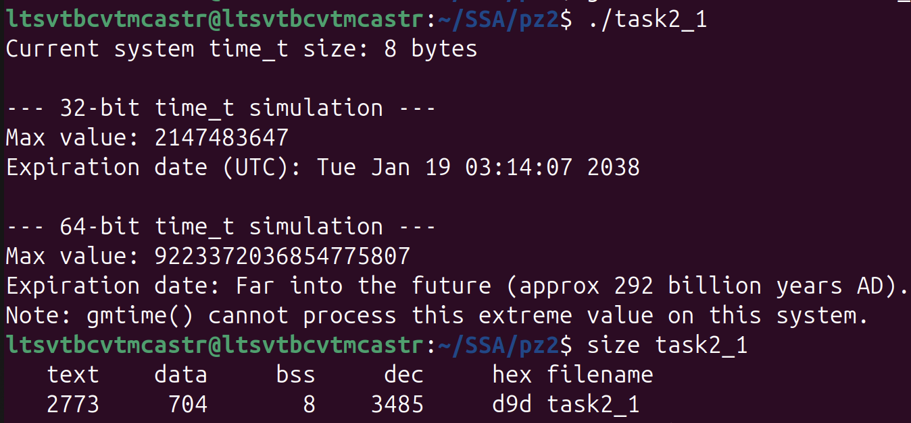
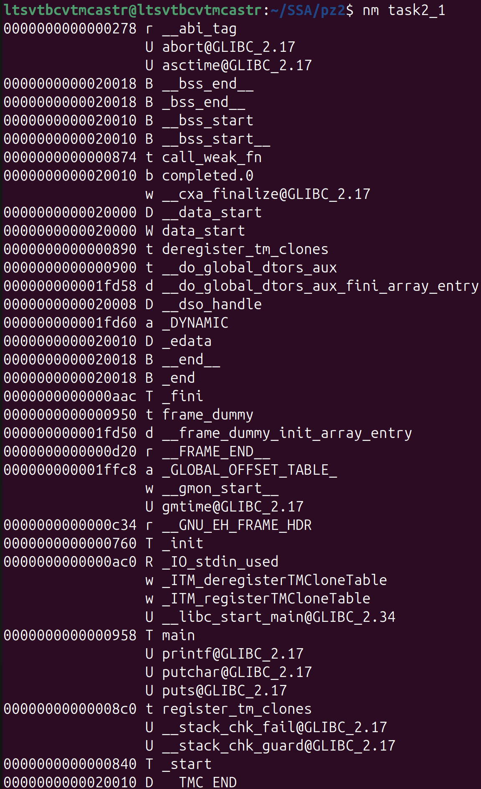

---

## Task 2.2
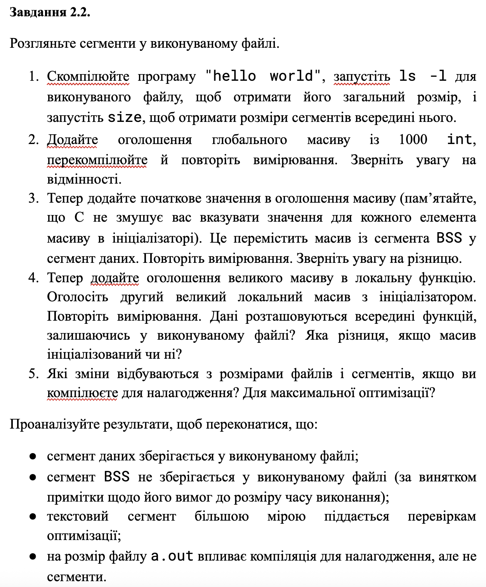

### Explanation
This experiment highlights how memory structure shifts dynamically:
* **Global Uninitialized Array:** Allocating a global array without initialization inflates the `bss` segment. The physical file size on disk stays virtually unchanged.
* **Global Initialized Array:** Initializing the array forces it out of the `bss` segment and into the `data` segment, noticeably increasing the physical disk footprint of the file.
* **Local Arrays:** Declaring large arrays inside the local scope of a function does not alter the size of static `data` or `bss` file segments, as space is dynamically reserved on the Stack at runtime.
* **Debugging Flag (`-g`):** Compiling with debugging symbols drastically increases the overall file size on disk due to embedded metadata, while memory segments (`text`, `data`, `bss`) remain unchanged.
* **Optimization Flag (`-O3`):** Applying compiler optimization noticeably shrinks the `text` segment size.

### Results
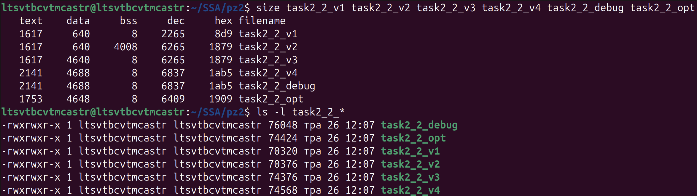

---

## Task 2.3
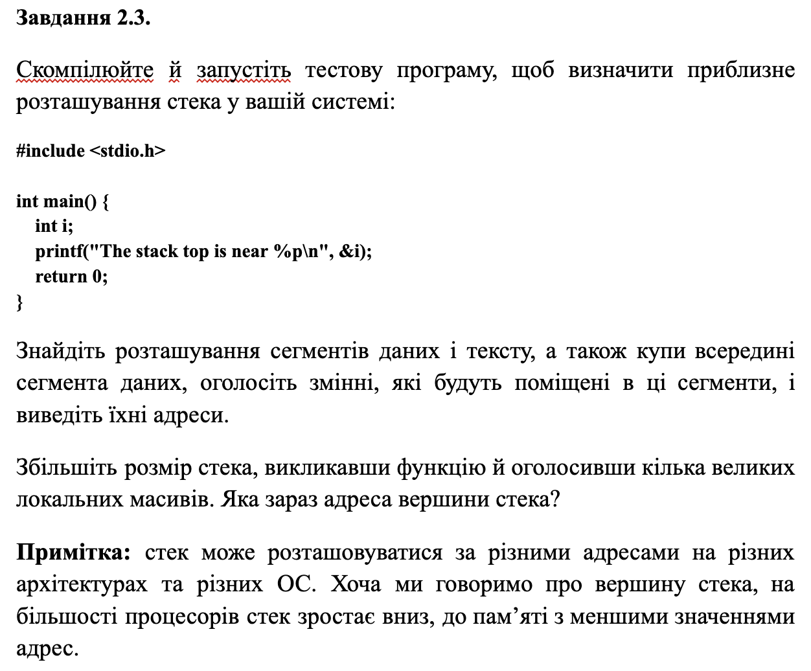

### Explanation
The memory space addresses printed by the program showcase the high-level layout of the process virtual address space. The `text`, `data`, and `bss` regions reside within the lower range of virtual memory bounds. The heap segment starts above them and grows upwards. 

The stack region is built into the uppermost bounds of the application address space. When the program calls the secondary routine and instantiates a massive local data buffer, the stack boundary address drops lower, proving that the system stack allocation grows downwards (from higher to lower memory addresses).

### Results
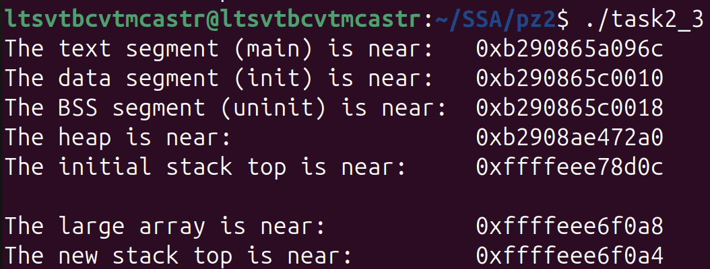

---

## Task 2.4
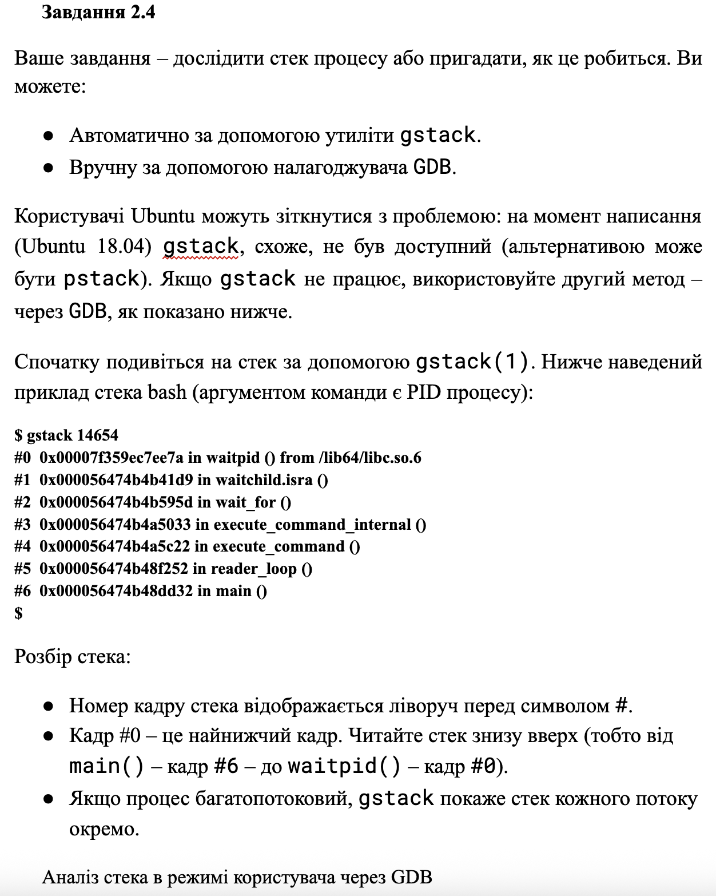
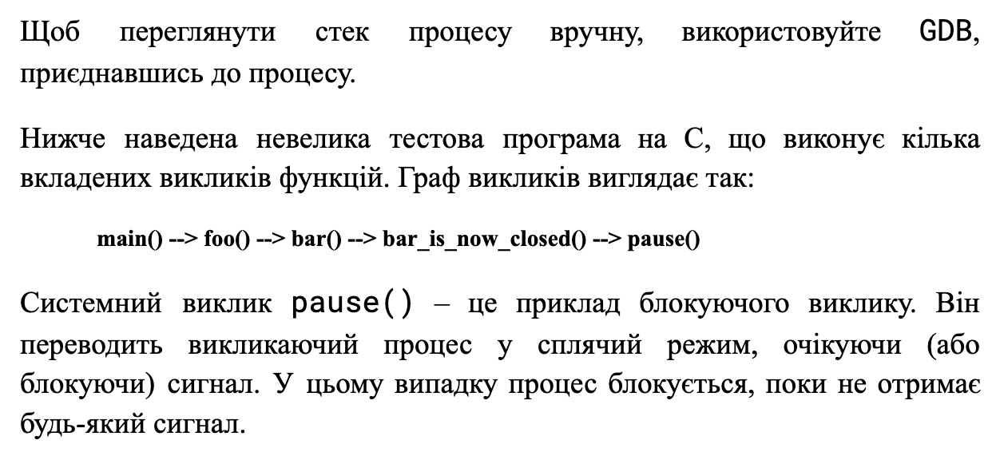
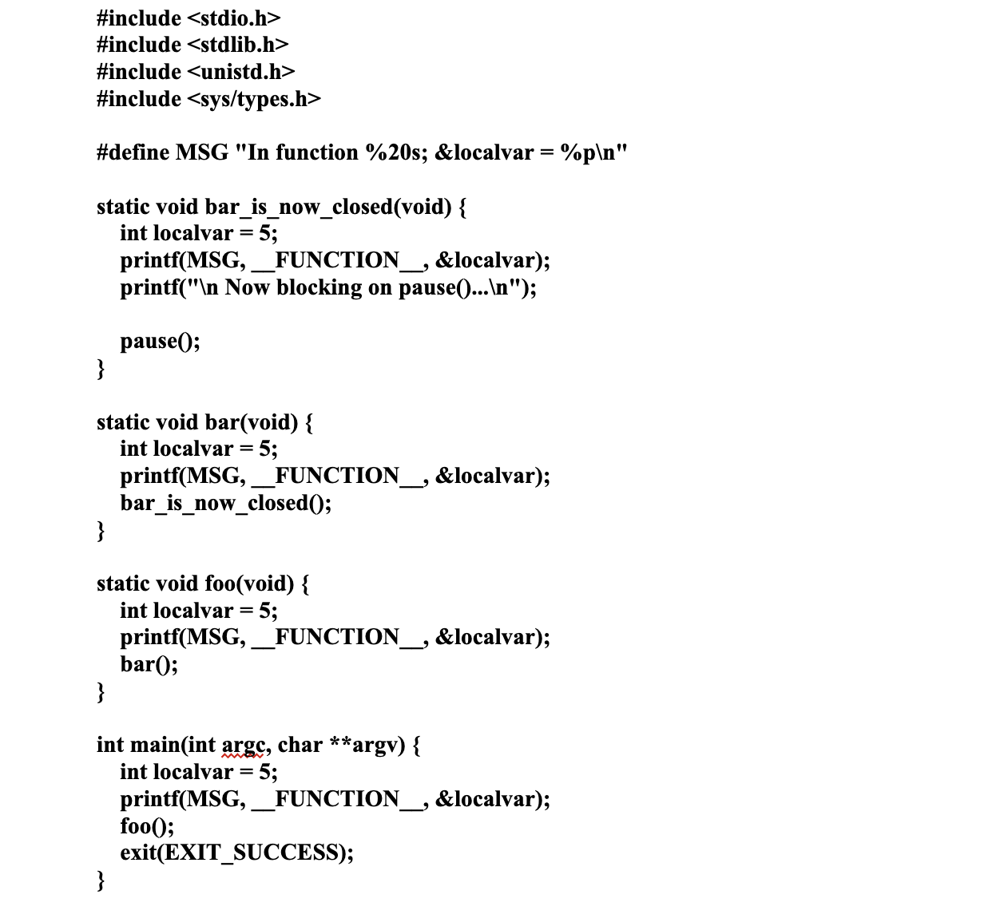
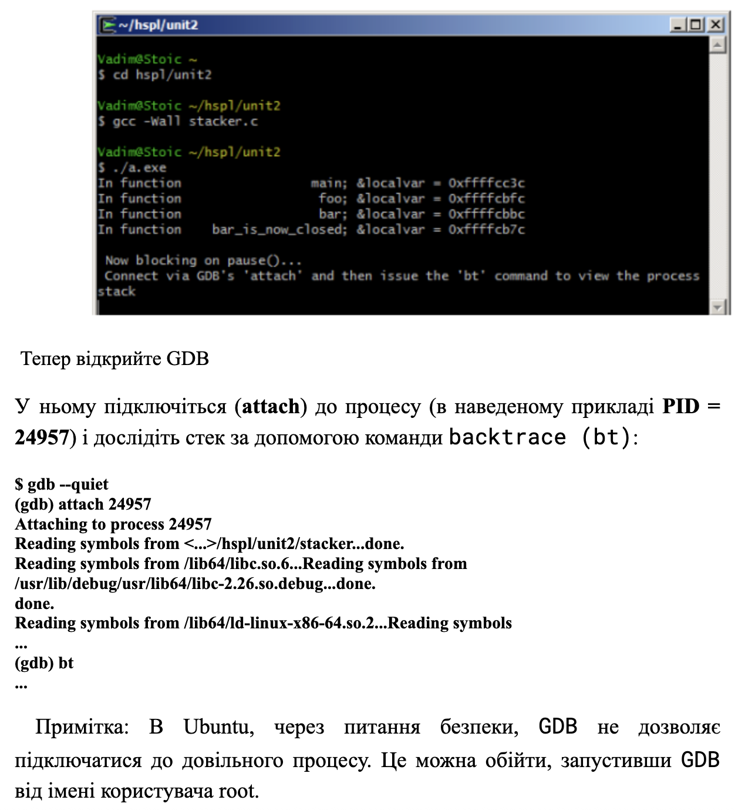
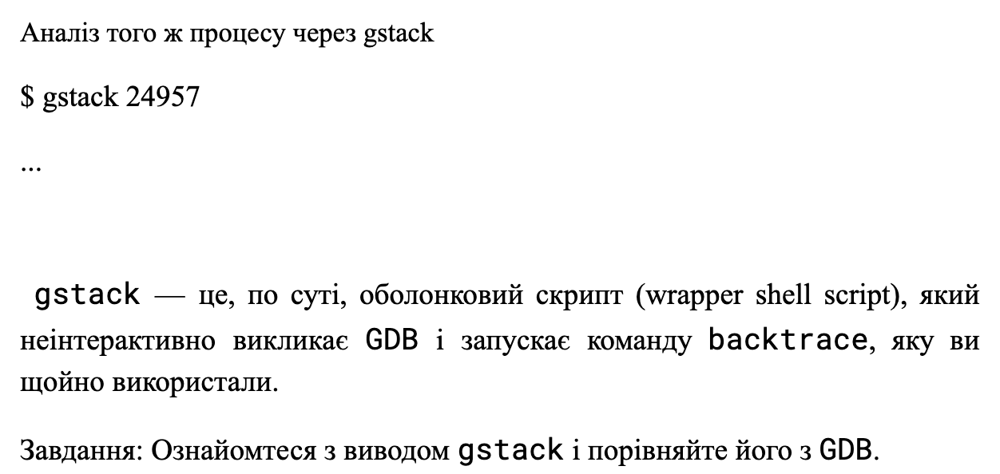

### Explanation
Using the `GDB` utility and running the `bt` (backtrace) command prints out the full frame history of the paused application execution chain. The trace tracks the execution stack context from the primary frame layout upwards (from `main` to `foo`, `bar`, `bar_is_now_closed`, and finally to the system call `pause`).

Running the alternative automated tool `gstack` triggers a `command not found` error, which is expected on modern Ubuntu distributions. `gstack` acts as an automated, non-interactive pipeline wrapper directly over `GDB`; therefore, its execution response under operational states strictly mirrors the manual trace log.

### Results
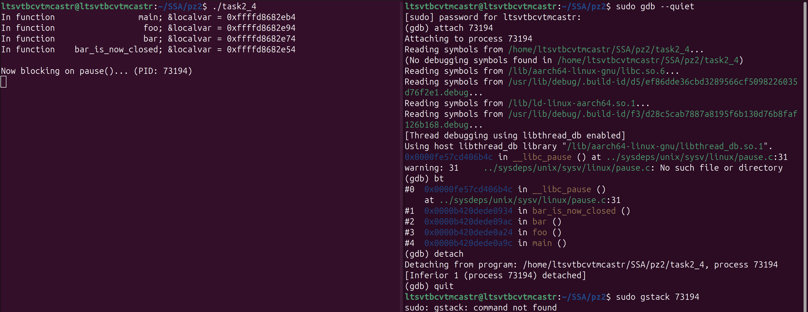

---

## Task 2.5
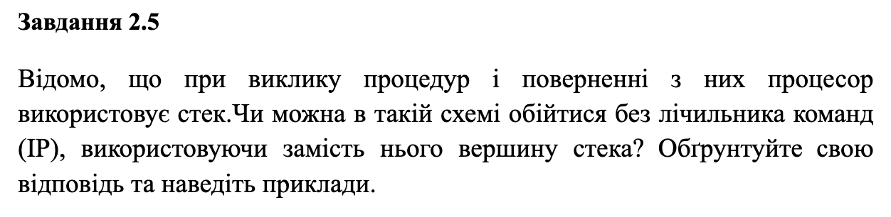

### Explanation
In a conventional von Neumann architecture, completely discarding the Instruction Pointer (`IP`) to rely strictly on the Stack Pointer is impossible. The hardware system needs a dedicated `IP` register to sequentially read and execute instructions in the text segment. If a machine fetched raw instruction sequences entirely off the top of the stack, it would create an execution paradox, as a baseline index register would still be required to locate the target address data block. 

**The Exception: Return-Oriented Programming (ROP)**
In cybersecurity, an attacker can overwrite the stack with a sequence of return addresses pointing to existing tiny instruction segments ("gadgets") ending with a `ret` directive. When the CPU executes `ret`, it pops the address at the top of the stack into the `IP`. In this exploit model, the traditional linear operation of the `IP` is bypassed, and the structural arrangement of memory pointers inside the Stack frame dictates the instruction roadmap.

---

## Task 2.v12

### Explanation
This program acts as a custom low-level parser emulating the initial validation stages of an ELF file loader. The routine opens a target binary file, maps it into memory using `mmap`, and validates the file signature against standard magic sequences (`ELFMAG`). 

Once verified, it parses the metadata layout to locate the entry point and extracts the program headers. The parser then explicitly loops through the file structure to locate headers flagged as `PT_LOAD`, which represent code and data blocks that must be mapped into physical RAM. The output prints their corresponding virtual address spaces and required memory block limits.

### Results
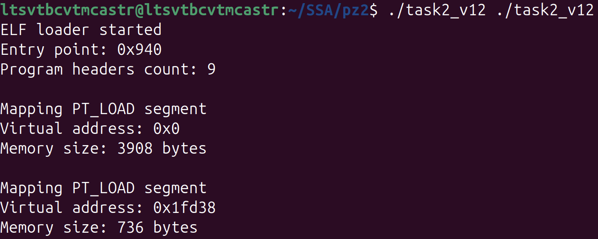